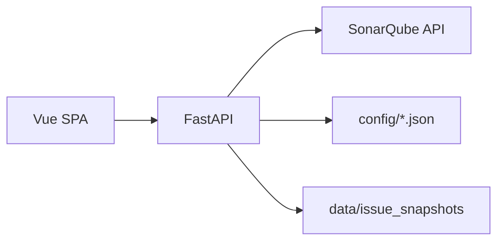

# System Architecture

## Persona

- **Architect / Senior Dev**

## High-level

## Module grouping (단일 출처)

**Source of truth**: `config/module_grouping.json`

- 프로필(`java_tree`, `vue_src_tree` 등) + `projectProfiles`(프로젝트 id → 프로필)
- Java 예: `split_after` + `after: "/fims/"` → 모듈 세그먼트
- Vue 예: `path_tree` + `stripPrefixes` / `anchorAfter`

**Implementation**: `app/core/module_extract.py`, `app/core/module_path_tree.py`  
**Why**: 집계 키와 차트 축이 **같은 규칙**을 쓰도록 한곳에서만 정의한다.

**미분류 축 이름**: 앵커 미매칭 등으로 내부 토큰이 `unknown`이면, 대시보드·CSV 축에는 `defaults.chartStackUnmappedBucket`(또는 프로필별 `chartStackUnmappedBucket`) 문자열을 쓴다. 팀 매칭 등은 내부적으로 계속 `unknown` 토큰을 사용한다.

## Metrics pipeline

1. **단일 프로젝트** (`projectId` ≠ `all`): `componentKey`로 Sonar **OPEN 이슈 전량** 수집 — 하한은 `component_projects.json` 의 `severityFloor` → `severity_floor_for_full_metrics` (`sonarqube_issues_fetch.fetch_all_issues`).
2. **ALL 병합** (`projectId=all`): 프로젝트마다 OPEN 중 B·H·M만 수집 — 하한은 `severity_floor_for_aggregate_scope`(미지정 시 MEDIUM) → `fetch_open_issues_for_floor`.
3. 집계: Severity·모듈·차트 스택·팀 High risk (`metrics_service`, `team_high_risk`). 경로·팀 버킷은 **`issue_component_key`** 로 `component` / `mainComponent.key` 불일치를 제거.
4. **신선도**: 메모리(`_PROJECT_CACHE` 등) + 디스크 스냅샷. 디스크 `manifest.json` 에 `severityFloor` 를 기록해 **JSON 하한 변경 시 TTL 전에도** 스냅샷을 쓰지 않음. 동시 수집 방지는 `issue_snapshot_coordinator` 락.
5. **무효화**: `invalidate_dashboard_cache` — 팀 매핑 저장, `POST /api/admin/invalidate-cache`, 대시보드 톱니 메뉴 동작.

## Issues list (`/api/issues/search`)

- 스냅샷(`issues_full`)이 유효하면 로컬 필터·페이징 — 대시보드와 동일 이슈 세트.
- `?source=live` 또는 미지원 정렬·다중 `componentKeys` 는 Sonar 프록시.

## Trade-offs

| 결정 | 이유 |
|------|------|
| 메모리 + 디스크 이중 캐시 | 재시작 후에도 디스크로 Sonar 재호출 완화; DB 없이 운영 |
| Sonar 순차 호출 | 고객 Sonar 부하 완화 |
| SPA를 Python이 서빙 | 단일 포트 배포 단순화 |

## See also

- [module-segment-labels.md](./module-segment-labels.md)
- [frontend-ui.md](./frontend-ui.md)
- [db-schema.md](./db-schema.md)
