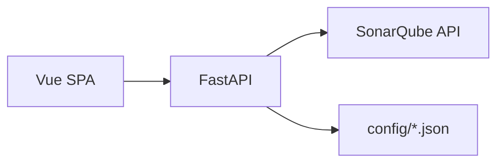

# System Architecture

## Persona

- **Architect / Senior Dev**

## High-level

## Module grouping (단일 출처)

**Source of truth**: `config/module_grouping.json`

- 프로필(`java_tree`, `vue_src_tree` 등) + `projectProfiles`(프로젝트 id → 프로필)
- Java 예: `split_after` + `after: "/fims/"` → 모듈 세그먼트
- Vue 예: `path_tree` + `stripPrefixes` / `anchorAfter`

**Implementation**: `app/core/module_extract.py`, `app/core/module_path_tree.py`  
**Why**: 집계 키와 차트 축이 **같은 규칙**을 쓰도록 한곳에서만 정의한다.

## Metrics pipeline

1. 프로젝트별 `componentKey`로 Sonar **OPEN 이슈 전량** 수집 (`sonarqube_issues_fetch`).
2. Severity·모듈·차트 스택·팀 High risk 집계 (`metrics_service`, `team_high_risk`).
3. TTL 캐시 — 설정 변경 시 무효화 훅(팀 매핑 등).

## Trade-offs

| 결정 | 이유 |
|------|------|
| 서버 메모리 캐시 | DB 없이 빠른 응답; 재시작 시 재집계 |
| Sonar 순차 호출 | 고객 Sonar 부하 완화 |
| SPA를 Python이 서빙 | 단일 포트 배포 단순화 |

## See also

- [module-segment-labels.md](./module-segment-labels.md)
- [frontend-ui.md](./frontend-ui.md)
- [db-schema.md](./db-schema.md)
